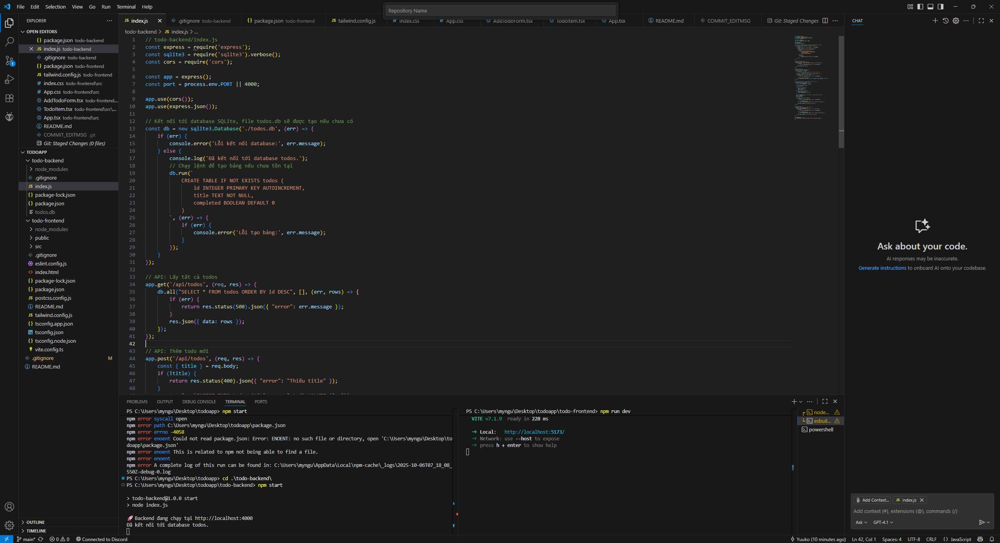
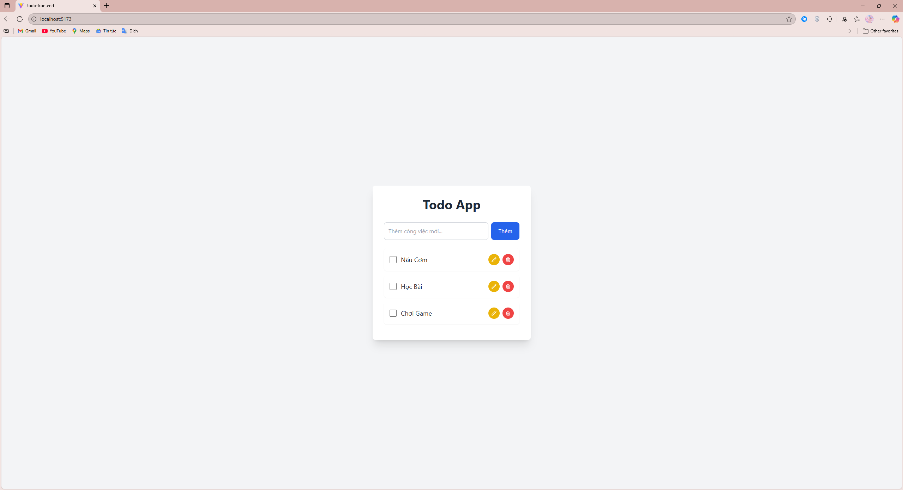
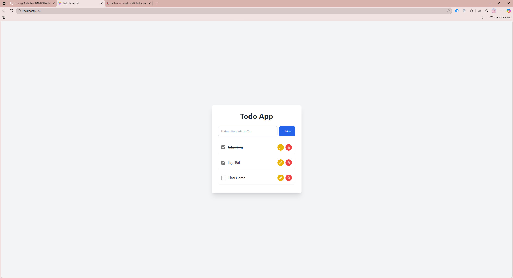
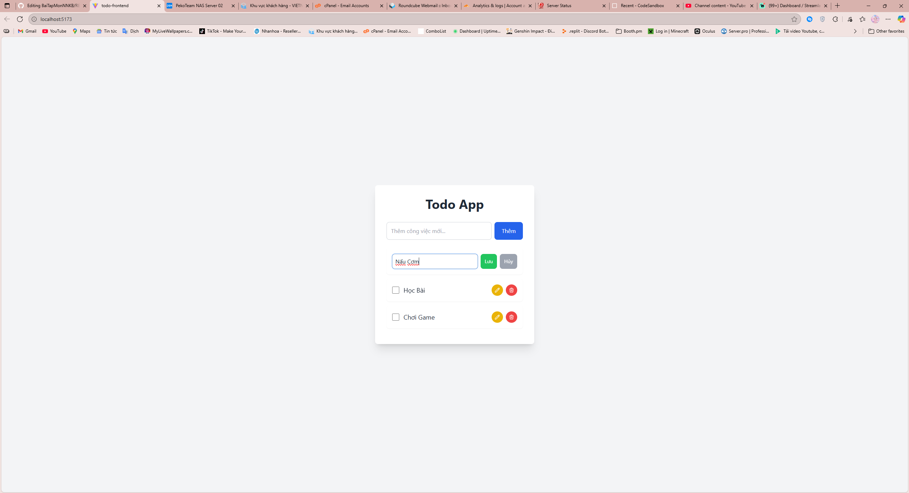

# 📝 Todo App - Bài tập môn Ngôn ngữ kịch bản Node.js

---

### **🧑‍💻 Thông tin cá nhân**

- **Họ và tên :** Nguyễn Trần Tài
- **Mã số sinh viên :** 2472020054
- **Lớp :** D19CNTT1B

---

### **⚙️ Công nghệ sử dụng trong bài tập**

Ứng dụng được xây dựng trên hai phần chính:

**Backend:**
- **Node.js:** Nền tảng chạy JavaScript phía server.
- **Express.js:** Framework để xây dựng API.
- **SQLite:** Hệ quản trị cơ sở dữ liệu nhẹ, lưu trữ dữ liệu bền vững trong file.
- **CORS:** Middleware để cho phép frontend giao tiếp với backend.

**Frontend:**
- **React.js:** Thư viện JavaScript để xây dựng giao diện người dùng.
- **Vite:** Công cụ build hiện đại, cho trải nghiệm phát triển nhanh.
- **TypeScript:** Giúp code an toàn và dễ bảo trì hơn.
- **Tailwind CSS:** Framework CSS để tạo giao diện đẹp mắt và nhanh chóng.
- **Axios:** Thư viện để thực hiện các cuộc gọi API đến backend.

---

### **📑 Các tính năng chính**

- [x] Thêm công việc mới.
- [x] Hiển thị danh sách các công việc.
- [x] Đánh dấu một công việc là đã hoàn thành (và bỏ đánh dấu).
- [x] Chỉnh sửa nội dung của một công việc.
- [x] Xóa một công việc.
- [x] Dữ liệu được lưu trữ bền vững trong database SQLite, không bị mất khi khởi động lại server.

---

### **🖼️ Hình ảnh ứng dụng**

**1. Giao diện chính của chạy code:**


**2. Giao diện chính của ứng dụng:**


**3. Chức năng đánh dấu công việc đã làm:**


**4. Chức năng chỉnh sửa công việc:**


---

### **🖥️ Hướng dẫn cài đặt và chạy thử**

1. **Clone repository:**
   ```bash
   git clone https://github.com/SmileNguyen/BaiTapMonNNKB.git

2. **Cài đặt dependencies cho Backend:**
   ```bash
   cd todoapp/todo-backend
   npm install

3. **Cài đặt dependencies cho Frontend:**
     ```bash
   cd ../todo-frontend
   npm install

4. **Chạy Backend (tại thư mục todo-backend):**
   ```bash
   npm start

5. **Chạy Frontend (mở terminal khác, tại thư mục todo-frontend):**
   ```bash
   npm run dev

---

### **🔎 Sau đó truy cập http://localhost:5173 (hoặc cổng mà Vite cung cấp).**

---

© Copyright 2025 by Yuuko (aka: Tài Nguyễn) | Bài tập được làm từ: Sunday, October 5, 2025 at 9:33 AM đến Monday, October 6, 2025 at 1:09 PM.

<h2>Thông tin liên hệ ngoài không có trong bài học</h2>

**✉️ Email: ngtrantai2004@gmail.com / admin@smvtb.click**

**🕊️ Twitter: @SmileNguyen04**

**📸 Youtube: @**

### 📊 Thống kê hoạt động:


### 📖 Ngôn ngữ phổ biến:


### 👀 Số người đã xem:


